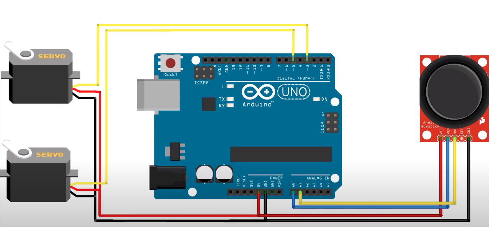

# PontusLiedgren/arduino-maze-game

IRL maze game controlled using a B103 267 joystick. 

## Introduction

The projects consist of an input and an output.

Firstly, the joystick input. While moving the joystick in a direction it sends out a pulse to the arduino telling it which direction it has moved, based on x- and y-directions…

Secondly the output. Based on the joysticks movements the arduino sends out a pulse to the servos telling them which way to move. The servos are controlled based on the x- and y-values sent out from the joystick. One servo takes the y -value and moves accordingly to it’s translated value, while the other servo takes the x -value and moves accordingly to it’s translated values. 

## Equipment

- B103 267 Joystick
- Arduino UNO R3 
- 2 Servo Motor FS5103B

## Circuit Diagram/Schematic

